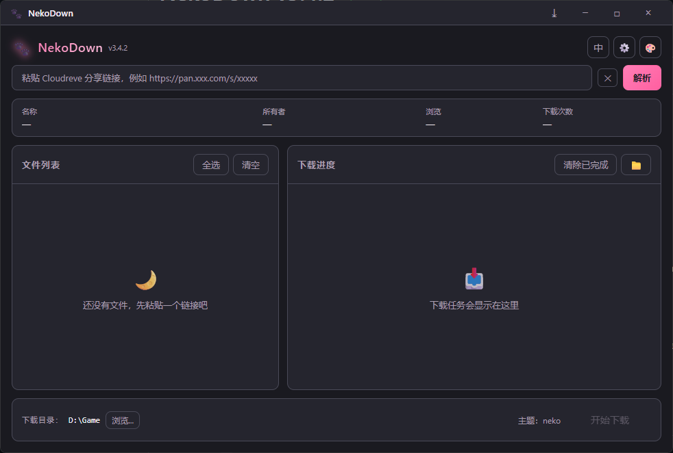
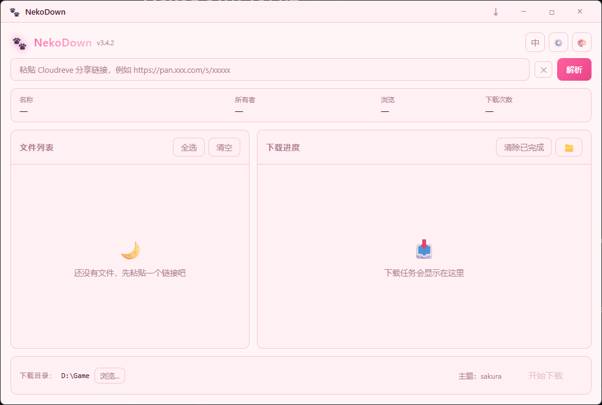

# NekoDown

**专为 NekoGAL 优化的 Cloudreve 分享链接下载工具**

提供原生 GUI 和命令行两种使用方式，自动调用 aria2 多线程下载，支持中日文文件名、断点续传、磁盘空间检查、自动重试。

> 🐾 **本工具针对 [NekoGAL](https://www.nekogal.com/) 深度优化**，完美支持其 Cloudflare R2 存储后端、大文件下载及中文/日文文件名处理。

---

## ✨ 特性

- 🪟 **原生 GUI**（Tauri + WebView2）：暗色/亮色双主题切换，单文件 .exe 仅约 5 MB
- 📦 **单文件运行**：`nekodown-gui.exe` 内置全部脚本与语言包，首次启动自动释放，无需携带 `lib/` 文件夹
- 🌿 **绿色优先**：释放位置跟随 exe 所在目录（桌面、U盘均可）；若目录只读则自动 fallback 到 `%LOCALAPPDATA%`
- ⌨️ **命令行版本**（PowerShell）：纯 ps1 脚本，绿色便携，零依赖
- 🚀 **多线程加速**：aria2 多连接下载，可配置 1-64 线程
- 📦 **自动安装 aria2**：首次运行自动下载到 `tools/aria2/`，无需手动配置
- 🌍 **中英双语**：默认按系统语言切换，可手动指定 `zh-CN` / `en-US`
- 🔄 **断点续传**：检测 `.aria2` 控制文件，中断后自动恢复
- 🛡️ **安全文件名**：自动替换 Windows 非法字符与保留名（CON/PRN…）
- 💾 **磁盘空间检查**：下载前自动验证可用空间

### 🎨 主题预览

| Neko Dark | Neko Light |
|:---------:|:----------:|
|  |  |

---

## 📥 下载

到 [GitHub Releases](https://github.com/Arcohyp/NekoDown/releases) 下载最新版：

| 文件 | 用途 |
|---|---|
| `NekoDown_x.y.z_x64-setup.exe` | **NSIS 安装器**（推荐），自动创建开始菜单快捷方式与卸载入口 |
| `nekodown-gui.exe` | **单文件 GUI**，下载到任意位置双击运行，首次启动自动释放所需文件 |
| `NekoDown_x.y.z_x64-portable.zip` | **完整便携包**，含 CLI 工具（`neko-down.ps1` + `lib/`），绿色免安装 |

---

## 🚀 快速开始

### GUI 用户

1. 双击 `NekoDown_x.y.z_x64-setup.exe` 安装，或直接把 `nekodown-gui.exe` 放到任意目录
2. 启动 NekoDown，把 Cloudreve 分享链接粘贴到顶部输入框
3. 点 **Parse**，文件列表加载完后点 **开始下载**
4. 右上角 🎨 按钮切换主题

> 即使只复制了单个 `nekodown-gui.exe`，首次启动也会自动释放所需的 `lib/` 脚本和 `lang.json`（优先放在 exe 旁边，若不可写则放到 `%LOCALAPPDATA%\NekoDown`）。

支持的链接格式：

```
https://pan.nekogal.top/s/xxxxx
https://pan.nekogal.top/home?path=cloudreve%3A%2F%2Fxxxxx%40share
https://share.nekogal.top/home?path=cloudreve%3A%2F%2Fxxxxx%40share
https://pan.xxx.com/s/xxxxx        (任何 Cloudreve v4 实例)
```

### 命令行用户

```powershell
# 交互模式
.\neko-down.ps1

# 直接传链接
.\neko-down.ps1 -ShareLink "https://pan.nekogal.top/s/yE4u7"

# 指定目录和线程数
.\neko-down.ps1 -ShareLink "..." -OutputDir "D:\Downloads" -Aria2Connections 32
```

或双击根目录的 `双击运行.cmd`。

---

## ⚙️ 配置

编辑 `config.json`（GUI 与 CLI 共用）：

```json
{
  "defaultOutputDir": "C:\\NekoDown\\downloads",
  "defaultConnections": 16,
  "autoRetry": true,
  "maxRetries": 3,
  "logEnabled": true,
  "checkDiskSpace": true,
  "minFreeSpaceGB": 2,
  "proxy": "",
  "language": "auto"
}
```

| 字段 | 说明 | 默认 |
|---|---|---|
| `defaultOutputDir` | 默认下载目录 | `<安装目录>/downloads` |
| `defaultConnections` | aria2 连接数 (1-64) | `16` |
| `maxRetries` | 失败重试次数 | `3` |
| `proxy` | HTTP 代理 | `""` |
| `language` | `auto` / `zh-CN` / `en-US` | `auto` |

GUI 内的设置面板会以图形化形式同步这份配置。

---

## 🏗️ 架构

```
NekoDown/
├── neko-down.ps1            CLI 入口（225 行薄壳，dot-source lib/*）
├── config.json              共享配置
├── lang.json                中英双语字典（125 keys）
├── lib/
│   ├── core.ps1             下载核心（API、aria2、Start-FileDownload）
│   ├── i18n.ps1             本地化（L 函数 + lang.json 加载）
│   ├── log.ps1              Logger 类 + 控制台输出助手
│   └── tauri-bridge.ps1     供 Rust 调用的 JSON-lines 桥接
├── gui-tauri/               Tauri 2 GUI 项目
│   ├── src/                 前端 (HTML + CSS + JS)
│   └── src-tauri/           后端 (Rust)
└── 双击运行.cmd              CLI 启动器
```

GUI 采用 Tauri 架构：Rust 后端负责 GUI 壳子、进程编排和资源分发；下载实际由 PowerShell 端复用 `lib/` 完成。Rust 侧在编译时将 `lib/*.ps1` 与 `lang.json` 通过 `include_str!` 嵌入二进制，首次启动自动释放到磁盘（绿色优先，目录不可写时 fallback 到 `%LOCALAPPDATA%`）。前端通过 `invoke()` 调 Rust 命令，进度通过 Tauri event 实时回流到 ProgressBar。

---

## 🔧 从源码构建

### CLI

无需构建，直接运行 `.\neko-down.ps1`。

### GUI

需要：

- [Rust](https://rustup.rs/)（rustup 一键装）
- [Microsoft C++ Build Tools](https://visualstudio.microsoft.com/visual-cpp-build-tools/)（含"使用 C++ 的桌面开发"工作负载）
- WebView2 运行时（Win10/11 自带）

```powershell
cd gui-tauri
cargo install tauri-cli --locked
cargo tauri dev          # 开发模式（热重载）
cargo tauri build        # 出 release .exe + NSIS 安装器
```

构建产物在 `gui-tauri/src-tauri/target/release/`：

- `nekodown-gui.exe` — 便携可执行
- `bundle/nsis/NekoDown_*_x64-setup.exe` — NSIS 安装器

---

## ❓ 常见问题

### 双击 .cmd 后窗口闪退

CLI 模式下：检查 `logs/` 里的日志，通常是 aria2 自动安装失败（首次运行需要联网）。手动安装：`winget install aria2.aria2`。

### 下载提示 403 Forbidden

NekoGAL 的 R2 存储有时对单一 IP 限速；脚本已配置浏览器级请求头。建议挂代理或换时段。

### GUI 没反应 / 白屏

检查 WebView2 是否安装：`Get-AppxPackage Microsoft.WebView2`。Win10 较老版本可能需要单独装一下：https://developer.microsoft.com/microsoft-edge/webview2/

### 中日文文件名乱码

`v3.0+` 强制 UTF-8。如果旧 Windows 还是乱码，去"区域设置 → 管理 → 更改系统区域设置"勾选"使用 Unicode UTF-8 提供全球语言支持"。

### 想下载 NekoGAL 之外的 Cloudreve 网盘？

支持。Parse-ShareLink 自动识别 `https://pan.xxx.com/s/xxxxx` 任何 Cloudreve v4 实例。

---

## 📝 更新日志

详见 [GitHub Releases](https://github.com/Arcohyp/NekoDown/releases)。


### v3.4.2 (2026-06-07)

- 🔒 **移除自动更新**：关闭自动下载安装功能，改为提示用户前往 GitHub Releases 手动下载，消除未签名 EXE 执行的 RCE 风险
- 🛡️ **安全加固**：`Sanitize-FileName` 增加 Unicode 全角斜杠过滤，Windows 保留名检查补全 `CLOCK$`/`COM0`/`LPT0`

### v3.4.1 (2026-05-17)

- 🐛 **修复自动更新崩溃**：重写 install_update，绕过签名验证崩溃
- 🔧 **引入签名密钥**：NSIS 安装器添加签名，支持 /UPDATE 静默更新
- 🎨 **分享信息显示修复**：长文件名溢出省略、grid 布局优化

### v3.4.0 (2026-05-17)

- 🎉 **重复文件检测**：下载前自动检查输出路径，已有文件跳过
- 🧹 **清除链接按钮**：Parse 旁新增 ✕ 按钮一键清空输入框
- 🔒 **自动粘贴收紧**：限定 /s/ 后 4-8 位字母数字
- 📦 **一键发版脚本**：新增 `scripts/bump-version.ps1`

> 更早版本详见 [GitHub Releases](https://github.com/Arcohyp/NekoDown/releases)。

---

## ⚠️ 注意

- Cloudreve 临时下载链接约 1 小时有效，脚本自动刷新
- 部分杀毒软件可能误报 PowerShell 脚本，请添加信任
- 版权归原作者，本工具仅供下载自己有权访问的内容

---

**Made with 🐾 for the [NekoGAL](https://www.nekogal.com/) community.**
